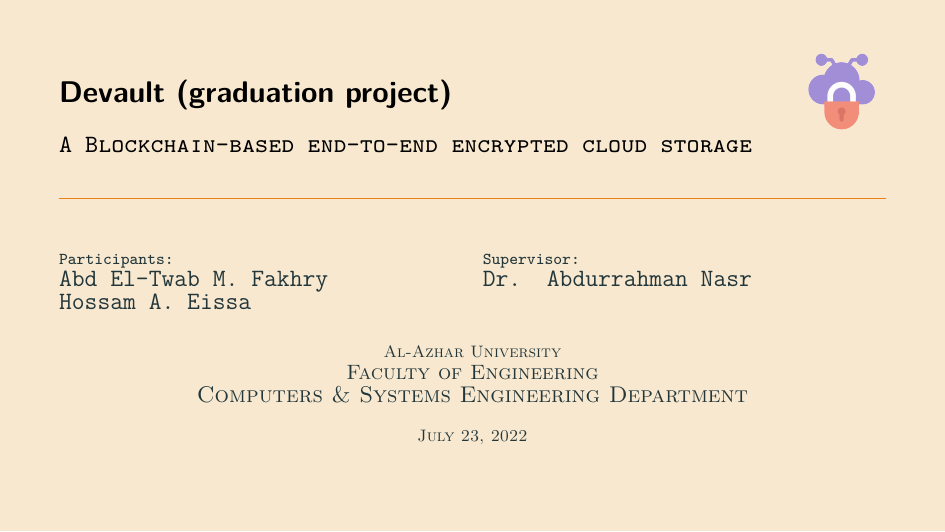

<h1 align="center">Devault - The Presentation</h1>

<h4 align="center">
	Presentation of the project entitled "Devault: A Blockchain-based, self-hosted, and end-to-end encrypted cloud storage"
</h4>

## Overview

This is the presentation of my bachelor thesis project entitled "Devault: A Blockchain-based, self-hosted, and end-to-end encrypted cloud storage" that I undertook in 2022.

## Preview



## Build

### Prerequisites

Before you jump into the build process, you have to install the following packages:

`texlive-bin` : TeX Live binaries <br/>
`texlive-core` : TeX Live core distribution <br/>
`tllocalmgr-git` : A shell and command-line utility to manage TeXLive on Arch Linux <br/>
`zathura` : A PDF viewer <br/>

If you are using Arch Linux, you can install these packages with the following command:

```sh
pacman -S texlive-bin texlive-core tllocalmgr-git zathura
```

If you are using Ubuntu, you can install these packages with the following command:

The full set of TeX Live packages.

```sh
sudo apt install texlive-full zathura
```

Or, the light version:

```sh
sudo apt install texlive zathura
```

Afterword, run:

```sh
make all clean
```

## License

Licensed under the [MIT](../LICENSE) license.
