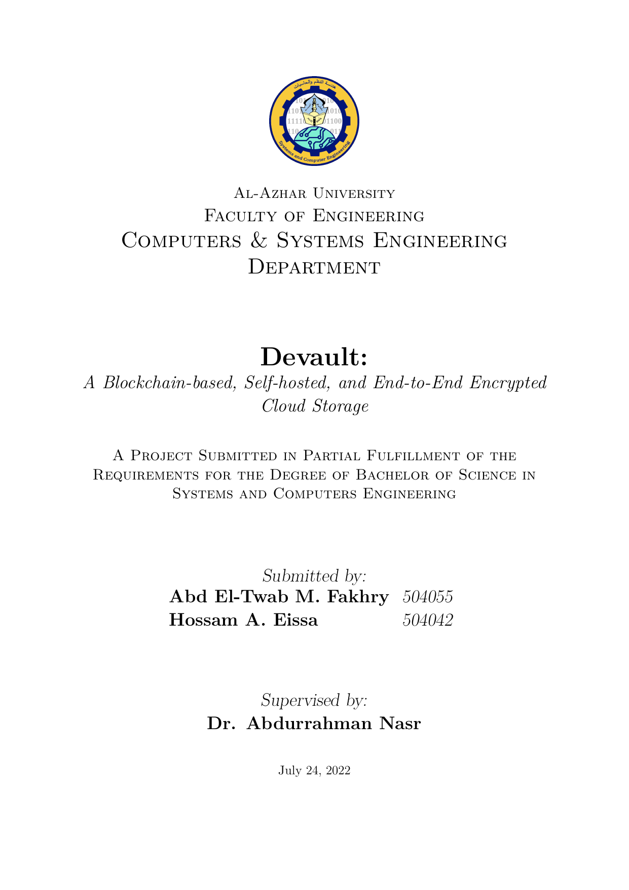

<h1 align="center">Bachelor Thesis</h1>

<h4 align="center">
	It is a Blockchain based system that can be used to store data in a decentralized and secure way.
</h4>

## Overview

My Bachelor Thesis is a project that I undertook in the year of 2022.
It is a Blockchain based system that can be used to store data in a decentralized and secure way.

## Preview



## Build

### Prerequisites

Make sure that `texlive` packages are present.

```sh
pacman -S texlive-bin texlive-core tllocalmgr-git
```

Afterword, run:

```sh
make all clean
``

## License

Licensed under the [MIT](LICENSE) license.
